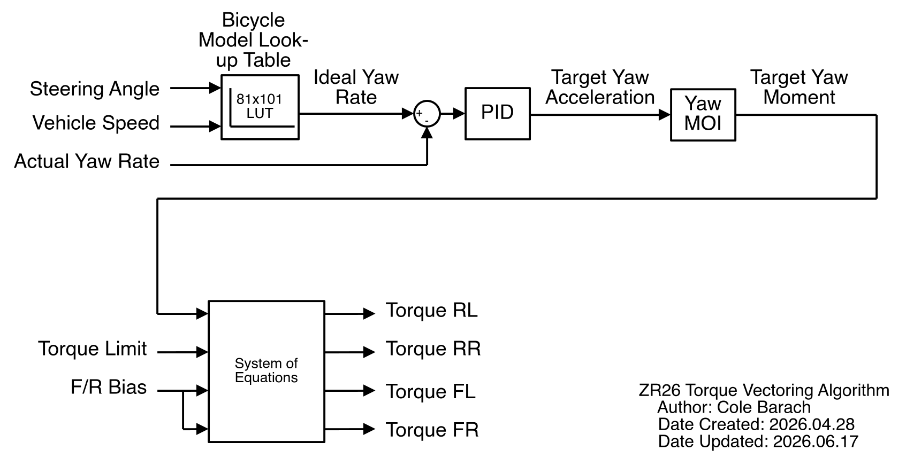

# Bicycle Model Torque Vectoring

The bicycle model torque vectoring algorithm is one of the torque vectoring algorithms the VCU implements. As its name implies, the algorithm is based on a bicycle model of the vehicle, specifically the bicycle model is used to determine a reference yaw rate.

*Note: A reference MATLAB implementation of this algorithm can be found in the doc/controls directory.*

Generalized, the bicycle torque vectoring algorithm can be summarized with the below diagram.



- Steering angle and vehicle speed are used to index a look-up table
- Said look-up table generates an ideal yaw rate for the vehicle
- This ideal yaw rate is subtracted from the actual yaw rate to determine a yaw rate error
- The yaw rate error is fed into a PID compensator to determine a target yaw acceleration
- From the yaw acceleration, the target yaw moment is calculated via the vehicle's moment of inertia
- The target yaw moment is used, along with the torque limit and the F/R torque bias, to solve a system of equations
- The solution to this system of equations is the torque to request of the 4 motors

## Yaw Lookup Table

The yaw lookup table fully encapsulates the "bicycle model" based portion of this algorithm. It is computed "offline" by a MATLAB script found in the vehicle dynamics GitHub repo:

https://github.com/ZipsRacingElectric/Vehicle-Dynamics

## System of Equations

The system of equations is used to find a single set of motor torques that satisfy the required constraints. As there are 4 motor torques, there must be 4 constraints. Summarized, these constraints are:

- The sum of the 4 motor torques must equal the torque limit
- The yaw moment applied to the vehicle by each motor must sum to the target moment
- The rear-inner and front-outer motors are not used to apply yaw moment
- The uncompensated torque request must respect the F/R bias.

Mathematically, this can be expressed as a matrix equation:

```

[ 1,             1,             1,             1             ]   [ torqueRl ]   [ torqueLimit                           ]
[ yawTransferRl, yawTransferRr, yawTransferFl, yawTransferFr ] x [ torqueRr ] = [ momentIdeal                           ]
[ 0,             1,             0,             0             ]   [ torqueFl ]   [ 0.5 * drivingBiasFr * torqueLimit     ]
[ 0,             0,             1,             0             ]   [ torqueFr ]   [ 0.5 * (1-drivingBiasFr) * torqueLimit ]

```

## Motor Torque to Yaw Moment Transfers

The amount of yaw moment a given motor will apply to the vehicle based on the requested torque is not a trivial problem, however it can be linearized by assuming 100% force transfer. In this situation, the problem can be simplified to a moment arm based on the gearbox reduction ratio.