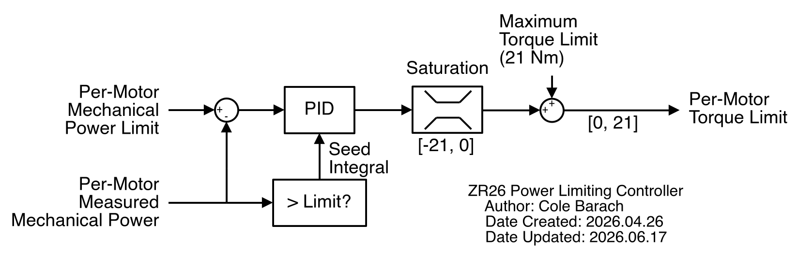

# Power Limiting

The FSAE rules enforce an 80kW power limit. As the 4 wheel drive configuration can easily exceed this limit, a control system must be employed to prevent accidential violations. This is the goal of the VCU's power limiter.

## General Description

The power limiter takes a single, electrical power limit and distributes it to 4 per-wheel limits. This is done as it is possible for 1 wheel to exceed the power limit while another wheel is not (take an accel run for instance, where the front wheels are spinning very quickly while the rear wheels are not). This distribution is based on the vehicle's F/R driving torque bias. If 75% of the torque is distributed to the rear axle, then 75% of the electrical power is too.

As the electrical power consumption of each wheel is not known, the VCU cannot directly control it. Rather, the electrical power limit can be related to a mechanical power limit, which can be controlled. This relation is currently done by a constant estimate of the vehicle's powertrain efficiency.

The per-wheel mechanical power limit can be enforced rather easily via a PID controller. Unfortunately, the power limiter cannot directly control the amount of torque requested of each motor (that is the job of torque vectoring), so it must output a limit that the torque vectoring algorithm must adhere to.

A high level diagram of this limiter is provided below:

### Integral Seeding

As the power limiter cannot directly control the amount of torque requested by each motor, there is a "deadzone" in its output. For instance:
- A motor exceeds the power limit with 15Nm of torque.
- The power limiter starts limiting the torque from the max value (21Nm).
- As the actual requested torque has not yet changed, the power limit is still exceeded.
- After 500ms, the power limiter output has reduced the torque to 14Nm.
- The power consumption finally starts to reduce.

This situation is quite common due to the front motors typically requesting low amounts of torque.

This issue can be resolved by "seeding" the PID controller with a default output. For instance:
- A motor exceeds the power limit with 15Nm of torque.
- The power limiter "knows" 15Nm is too much torque, so it begins limiting from 15Nm.
- The power consumption immediately reduces.

As the input of the PID cannot be modified, the only way to change the output is to modify the internal state. This can be done by changing the value of the integral term (the state, not the coefficient) in order to get the desired output.

## Tuning

Both the PID coefficients and the powertrain efficiency estimate require tuning for the power limiter to work. This can be done via the `can-eeprom-cli`, specifically with the below keys:
- `POWER_LIMIT_PID_KP`
- `POWER_LIMIT_PID_KI`
- `POWER_LIMIT_PID_KD`
- `POWER_LIMIT_PID_KA`
- `POWER_LIMIT_EFFICIENCY`

The efficiency term is best tuned after the PID terms, where the (stable) power consumption can be compared with the set power limit to calculate the theoretical powertrain efficiency. This term should reflect the minimum efficiency, and a margin of error should be built in here too.